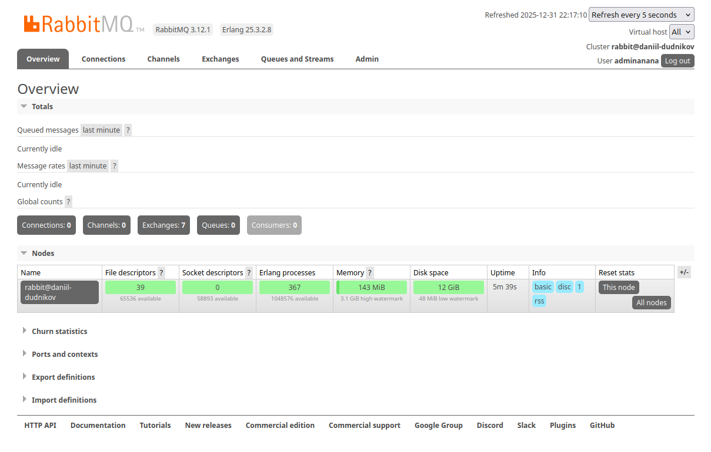
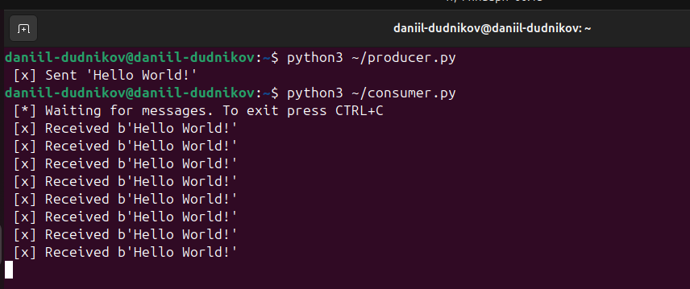
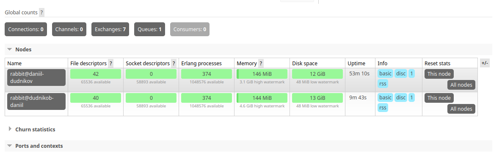
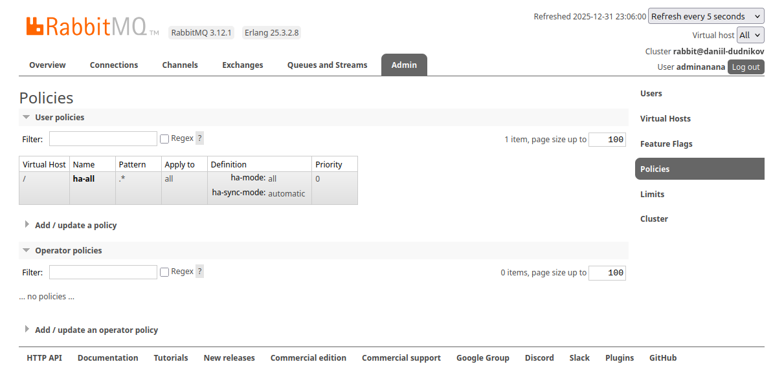
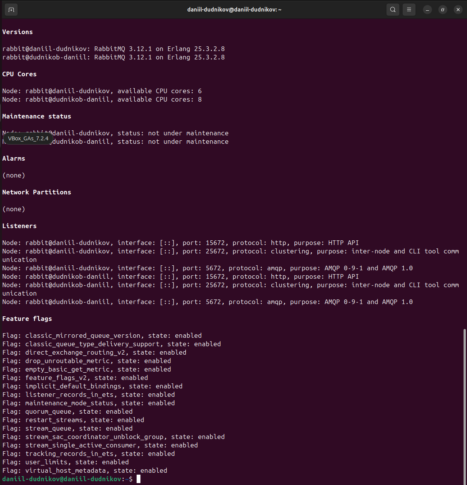
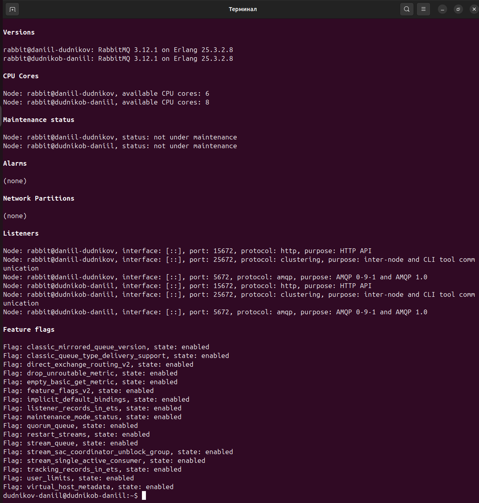
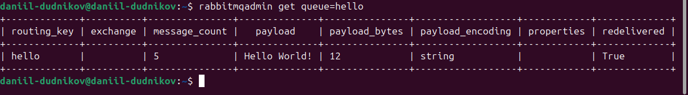
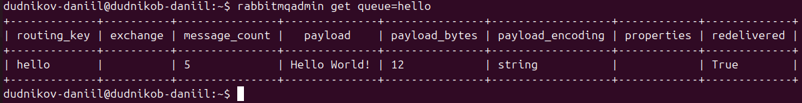

# Домашнее задание «Очереди RabbitMQ»
**Выполнил:** Даниил Дудников

## Задание 1. Установка RabbitMQ

## Задание 2. Отправка и получение сообщений
### Очередь hello с сообщением (веб-интерфейс)

### Вывод consumer.py (терминал)

## Задание 3. Подготовка HA кластера
### Кластер из 2 нод (веб-интерфейс)

### HA политика ha-all

### Статус кластера на ноде 1 (команда)

### Статус кластера на ноде 2 (команда)

### Сообщение на ноде 1 (rabbitmqadmin)

### Сообщение на ноде 2 (rabbitmqadmin)

## Заключение
Все задания выполнены успешно:
1.  RabbitMQ установлен с веб-интерфейсом
2.  Настроена отправка и получение сообщений через очередь "hello"
3.  Создан HA кластер из двух нод с политикой репликации ha-all
4.  Проверена репликация сообщений между нодами
5.  Протестирована отказоустойчивость кластера
